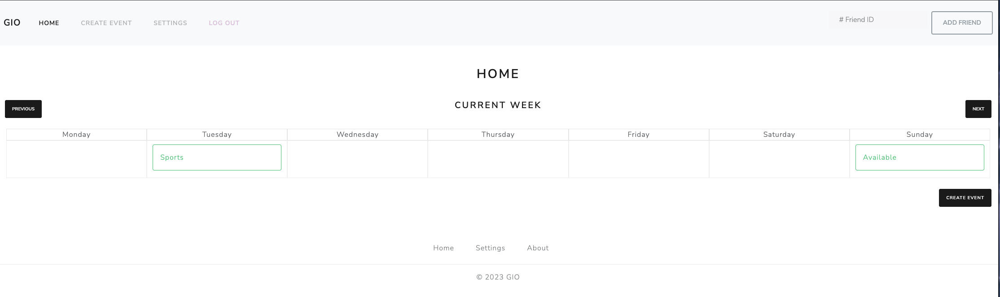

{: .label }
Dao Minh Duong Nguyen 

# Reference documentation
{: .no_toc }

{: .attention }
> This page collects internal functions, routes with their functions, and APIs (if any).
> 
> See [Uber](https://developer.uber.com/docs/drivers/references/api) or [PayPal](https://developer.paypal.com/api/rest/) for exemplary high-quality API reference documentation.
>
> You may delete this `attention` box.

{: .text-delta }

Table of contents

+ ToC
{: toc }

## Login

### `def login()`

**Route:** `/`

**Methods:** `GET` `POST` 

**Purpose:** handles login submission and renders either login or home template

**Sample output:**

after a successful login, the home template will be rendered 

---

## Register

### `def register()`

**Route:** `/register/`

**Purpose:** handles register submission and either renders register or home template

**Sample output:**

after a successful login, the home template will be rendered 

---

## Home

### `def index()`

**Route:** `/home`

**Purpose:** renders home page

**Sample output:**

---

## Settings

### `def settings()`

**Route:** `/settings/`

**Purpose:** renders setting page

**Sample output:**

Browser shows: `Database flushed and populated with some sample data.`

---

## Event

### `def event()`

**Route:** `/event/`

**Methods:** `GET` `POST` 

**Purpose:** handles form input and checks for validity

**Sample output:**

Invalid input produces Error-message